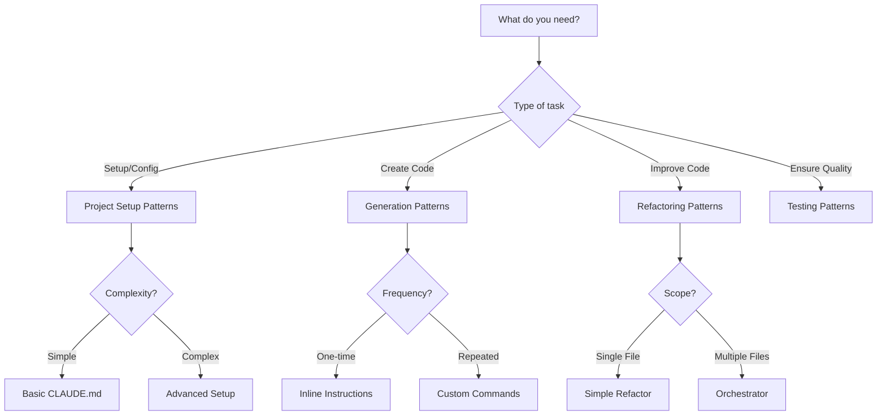

# Claude Code Pattern Catalog

A comprehensive guide to CLAUDE.md patterns organized by use case. Find the right pattern for your specific needs.

## 🗂 Pattern Categories

### [Project Setup](project-setup.md)
Patterns for initializing and configuring new projects:
- Boilerplate generation
- Dependency management
- Environment configuration
- Git initialization

### [Code Generation](code-generation.md)
Automated code creation patterns:
- Component scaffolding
- API endpoint generation
- Test suite creation
- Documentation generation

### [Testing & QA](testing-qa.md)
Quality assurance patterns:
- Test-driven development
- Coverage improvement
- E2E test automation
- Performance testing

### [Refactoring](refactoring.md)
Code improvement patterns:
- Legacy code modernization
- Performance optimization
- Architecture migration
- Technical debt reduction

### [Documentation](documentation.md)
Documentation patterns:
- API documentation
- Code commenting
- README generation
- Tutorial creation

## 🎯 Choosing the Right Pattern

### Decision Matrix

| Need | Recommended Pattern | Complexity |
|------|-------------------|------------|
| Quick project setup | Basic CLAUDE.md | ⭐ |
| Repetitive code generation | Custom commands | ⭐⭐ |
| Complex feature development | Task-driven orchestrator | ⭐⭐⭐ |
| Multiple file changes | Multi-file orchestrator | ⭐⭐⭐ |
| Exploring solutions | Infinite agent loop | ⭐⭐⭐⭐ |

### Pattern Selection Flowchart

## 📊 Pattern Comparison

### By Token Usage
1. **Most Efficient**: Basic CLAUDE.md with commands
2. **Moderate**: Custom commands with templates
3. **Intensive**: Multi-agent orchestrators

### By Learning Curve
1. **Beginner**: Basic configurations
2. **Intermediate**: Custom commands
3. **Advanced**: Orchestration patterns
4. **Expert**: Infinite loops, adaptive systems

### By Maintenance Needs
1. **Low**: Static CLAUDE.md files
2. **Medium**: Template-based commands
3. **High**: Complex orchestrators

## 🔧 Pattern Combinations

Some patterns work well together:

### "Full Stack Development Kit"
- Base: Web-dev CLAUDE.md
- Commands: Component generator, API builder
- Orchestrator: Task-driven for features

### "Quality Assurance Suite"
- Base: Testing-focused CLAUDE.md
- Commands: Test generator, coverage analyzer
- Orchestrator: Multi-file for test updates

### "Refactoring Toolkit"
- Base: Code quality CLAUDE.md
- Commands: Refactor assistant, debt analyzer
- Orchestrator: Adaptive for unknown codebases

## 💡 Best Practices

### Start Simple
1. Begin with basic CLAUDE.md
2. Add commands as patterns emerge
3. Graduate to orchestrators when needed

### Iterate Based on Use
- Track which commands you use most
- Note repetitive instructions
- Automate discovered patterns

### Share and Learn
- Document successful patterns
- Share with team/community
- Learn from others' approaches

## 📚 Learning Resources

### Tutorials
- [Creating Your First CLAUDE.md](../tutorials/first-claude-md.md)
- [Building Custom Commands](../tutorials/custom-commands.md)
- [Advanced Orchestration](../tutorials/orchestration.md)

### Case Studies
- [Startup MVP Development](../case-studies/startup-mvp.md)
- [Legacy System Modernization](../case-studies/legacy-modernization.md)
- [Open Source Maintenance](../case-studies/open-source.md)

---

*Remember: The best pattern is the one that saves you time and reduces errors. Start simple and evolve as needed.*